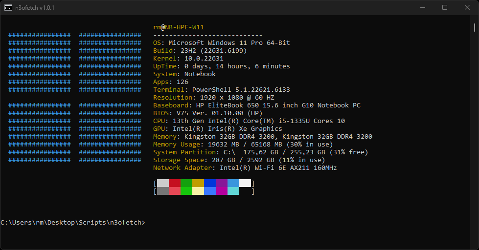

# n3ofetch


<p align="center">
  <b>A modern Windows alternative to the classic Linux tool <code>neofetch</code>.</b>
</p>

<p align="center">
  
</p>

---

## ✨ Features

- Operating system details (edition, version, build, architecture)
- System type detection (Client, Workstation, Notebook, Server, Virtual Machine)
- Hardware details (CPU, RAM, and more)
- Color-formatted output for Windows CMD
- Pure Batch script – no external tools or installation required
- Fast, portable, and easy to integrate

---

## 📦 Installation

1. Download the latest `n3ofetch.bat` from the Releases page.
2. Place it in a folder of your choice, e.g. `C:\Tools\n3ofetch\`.
3. (Optional) Add that folder to your `PATH` so you can run `n3ofetch.bat` from anywhere.

---

## ▶️ Usage

```cmd
n3ofetch.bat
```

Example output:

```text
                                       XYZ@YourDevice
  ################  ################   ----------------------------
  ################  ################   OS: Microsoft Windows 11 Pro 64-Bit
  ################  ################   Build: 23H2 (22631.6199)
  ################  ################   Kernel: 10.0.22631
  ################  ################   UpTime: 0 days, 14 hours, 6 minutes
  ################  ################   System: Notebook
  ################  ################   Apps: 23
  ################  ################   Terminal: PowerShell 5.1.22621.6133
                                       Resolution: 1920 x 1080 @ 60 HZ
  ################  ################   Baseboard: HP EliteBook 650 15.6 inch G10 Notebook PC
  ################  ################   BIOS: V75 Ver. 01.10.00 (HP)
  ################  ################   CPU: 13th Gen Intel(R) Core(TM) i5-1335U Cores 10
  ################  ################   GPU: Intel(R) Iris(R) Xe Graphics
  ################  ################   Memory: Kingston 32GB DDR4-3200, Kingston 32GB DDR4-3200
  ################  ################   Memory Usage: 19632 MB / 65168 MB (30% in use)
  ################  ################   System Partition: C:\  175,62 GB / 255,23 GB (31% free)
  ################  ################   Storage Space: 287 GB / 2592 GB (11% in use)
                                       Network Adapter: Intel(R) Wi-Fi 6E AX211 160MHz
```

More examples can be found in `docs/examples.md`.

---

## 📚 Documentation

- User Guide: `docs/documentation.md`
- Developer Guide: `docs/developer-guide.md`
- System Detection: `docs/system_detection.md`
- GitHub Pages Homepage: `docs/index.md`
- Examples & Screenshots: `docs/examples.md`

---

## 🤝 Contributing

Contributions are very welcome!  
Please read:

- `CONTRIBUTING.md`
- `CODE_OF_CONDUCT.md`
- `.github/PULL_REQUEST_TEMPLATE.md`

before opening issues or pull requests.

---

## ⚠️ Disclaimer

n3ofetch is provided **as-is**, without any warranty.  
It is a Windows alternative to the Linux tool *neofetch*.

**AS ALWAYS: USE THIS SCRIPT AT YOUR OWN RISK.**

See `DISCLAIMER.txt` for full details.

---

## 👤 Author
techronmic
Contact: techronmic@gmail.com

## 🙌 Support
https://www.paypal.com/donate/?hosted_button_id=U4MVM7GJ5XMDY

---

## 📜 License

This project is licensed under the MIT License. See `LICENSE` for details.
